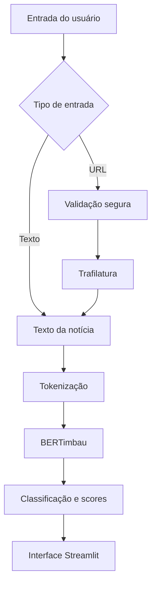

# NewsLens

> Aplicação inteligente de análise de notícias em português com Processamento de Linguagem Natural e Machine Learning.

O NewsLens analisa textos jornalísticos e apresenta uma classificação binária baseada em padrões linguísticos aprendidos por um modelo BERTimbau ajustado para o projeto. O resultado é uma predição do modelo, acompanhada da sua confiança, e não uma verificação factual da notícia.

O projeto foi desenvolvido como Projeto Integrador IV da UNIVESP, reunindo investigação científica, experimentação com modelos de linguagem e uma aplicação Streamlit.

## Objetivo

O sistema recebe texto digitado pelo usuário ou o conteúdo textual obtido a partir de uma URL de notícia. A interface apresenta uma das classificações:

- **Possivelmente falsa**
- **Possivelmente verdadeira**

Cada resultado também exibe a confiança do modelo e os scores do classificador.

O NewsLens não determina a verdade factual, não realiza fact-checking, não verifica a reputação do domínio e não substitui fontes jornalísticas ou serviços especializados de checagem.

## Como funciona

### Análise por texto

```text
Texto informado pelo usuário
        ↓
Tokenização pelo Transformers
        ↓
BERTimbau
        ↓
Classificação binária e scores
        ↓
Resultado na interface Streamlit
```

### Análise por URL

```text
URL informada pelo usuário
        ↓
Validação segura da URL
        ↓
Obtenção da página
        ↓
Trafilatura extrai o conteúdo principal
        ↓
Texto da notícia
        ↓
BERTimbau e classificação textual
        ↓
Resultado na interface Streamlit
```

A URL é somente uma forma de obter o texto. O domínio não determina a classificação e o NewsLens não atribui uma reputação ao site.

## Análise por URL e segurança

O módulo `app/extrator_noticia.py` utiliza Trafilatura para extrair o conteúdo textual principal de páginas compatíveis. Menus, navegação e outros elementos periféricos são evitados quando a extração consegue identificá-los. Algumas páginas podem não ser compatíveis, especialmente quando exigem login, paywall, bloqueios ou JavaScript para disponibilizar o conteúdo.

As URLs externas são tratadas defensivamente. A implementação:

- aceita somente HTTP e HTTPS;
- rejeita credenciais na URL;
- bloqueia localhost, loopback, IPs privados e endereços internos equivalentes;
- valida os destinos obtidos por DNS;
- valida novamente cada destino após redirects;
- permite no máximo três redirects;
- limita a resposta a 3 MiB;
- aplica timeouts de DNS, conexão, leitura e tempo total;
- restringe os tipos de conteúdo aceitos a HTML, XHTML e texto;
- rejeita conteúdos binários incompatíveis.

O HTML bruto não é enviado ao modelo. Depois da extração, somente o texto identificado como conteúdo da notícia segue para a classificação.

## Modelo

O modelo utilizado em inferência é [`lunecarvalho/newslens-bertimbau`](https://huggingface.co/lunecarvalho/newslens-bertimbau), publicado no Hugging Face.

Ele é baseado no BERTimbau para português brasileiro, originalmente pré-treinado a partir de [`neuralmind/bert-base-portuguese-cased`](https://huggingface.co/neuralmind/bert-base-portuguese-cased), e foi ajustado para classificação binária:

| Classe | Significado |
| ------ | ----------- |
| `0` | Falsa |
| `1` | Verdadeira |

Na aplicação:

- o tokenizer e o modelo são carregados com Transformers;
- o modelo é mantido em modo de avaliação;
- o recurso é reutilizado com `st.cache_resource`;
- textos são truncados quando excedem `512` tokens;
- os logits são convertidos em scores com softmax;
- os valores apresentados são confiança do modelo e score do classificador, não probabilidades factuais calibradas.

Na primeira execução, os arquivos do modelo podem ser baixados do Hugging Face. A disponibilidade da conexão externa e o cache das bibliotecas influenciam esse carregamento inicial.

## Resultados experimentais

Os resultados abaixo foram obtidos no conjunto de teste do Fake BR Corpus utilizado no projeto. Eles não representam uma garantia de desempenho para qualquer notícia externa.

O conjunto de teste possui 720 textos, sendo 360 falsos e 360 verdadeiros. O BERTimbau classificou corretamente 716 exemplos e errou 4:

| Modelo | Accuracy | Precision | Recall | F1-score |
| ------ | -------: | --------: | -----: | -------: |
| Regressão Logística | aproximadamente 90,63% | - | - | - |
| Multinomial Naive Bayes | aproximadamente 86,94% | - | - | - |
| Linear SVM | 92,22% | 91,30% | 93,33% | 92,31% |
| **BERTimbau** | **99,44%** | **99,72%** | **99,17%** | **99,44%** |

Para o BERTimbau, considerando `Verdadeira` como classe positiva:

- **Accuracy:** 99,44%
- **Precision:** 99,72%
- **Recall:** 99,17%
- **F1-score:** 99,44%

Matriz de confusão:

```text
[[359, 1],
 [3, 357]]
```

Esses resultados refletem a distribuição e os padrões do corpus utilizado. O desempenho pode variar em outros períodos, fontes, estilos editoriais e distribuições de dados.

## Experimentação científica

O repositório preserva as etapas de investigação que fundamentaram o projeto:

- análise exploratória de classes, tamanho dos textos, frequência de termos e diferenças lexicais;
- pré-processamentos experimentais, incluindo normalização, tokenização, lematização e reconhecimento de entidades;
- representações TF-IDF e avaliação de modelos clássicos;
- modelagem de tópicos com BERTopic;
- fine-tuning e avaliação do BERTimbau.

TF-IDF, BERTopic, NER, lematização e os demais experimentos não são executados durante a inferência atual da aplicação. O pipeline de runtime utiliza o texto de entrada, o tokenizer Transformers e o modelo BERTimbau publicado.

## Tecnologias

### Aplicação

- Python 3.11
- Streamlit
- Hugging Face Transformers
- PyTorch
- Trafilatura
- urllib3

### Ciência de dados e experimentação

- pandas
- NumPy
- scikit-learn
- NLTK
- spaCy
- BERTopic
- TF-IDF
- Matplotlib
- Seaborn

As bibliotecas de experimentação são utilizadas pelos notebooks e não fazem parte das dependências diretas do runtime da aplicação.

## Arquitetura



Principais responsabilidades:

- `app/app.py`: inicialização da aplicação, navegação, formulários e estado da sessão;
- `app/componentes.py`: telas de análise e apresentação do resultado;
- `app/model.py`: carregamento cacheado, validação de entrada e inferência;
- `app/extrator_noticia.py`: validação, obtenção segura e extração de texto por URL;
- `app/sobre.py`: página Sobre;
- `app/assets/`: estilos da interface.

## Estrutura do repositório

```text
newslens-project/
├── app/
│   ├── app.py
│   ├── componentes.py
│   ├── extrator_noticia.py
│   ├── model.py
│   ├── sobre.py
│   └── assets/
│       ├── analisando.css
│       ├── navegacao.css
│       ├── resultado.css
│       ├── sobre.css
│       └── style.css
├── datasets/
│   ├── cleaned_dataset.csv
│   ├── dataset_preprocessado.csv
│   ├── dataset_topics.csv
│   └── initial_dataset.csv
├── notebooks/
│   ├── 01_initial_data_analysis.ipynb
│   ├── 02_topic_modeling.ipynb
│   ├── 03_exploratory_data_analysis.ipynb
│   ├── 04_ner_lemmatizer.ipynb
│   ├── 05_training_testing_models.ipynb
│   ├── 05-2_training_testing_models.ipynb
│   └── 06_bertimbau_model.ipynb
├── results/
│   ├── analise_erros_svm.csv
│   ├── eda_bigramas_interpretacao.csv
│   ├── eda_bigramas_tfidf.csv
│   ├── metricas_svm_final.csv
│   ├── termos_associados_falsa.csv
│   └── termos_associados_verdadeira.csv
├── tests/
│   ├── test_app.py
│   ├── test_extrator_noticia.py
│   └── test_model.py
├── .gitignore
├── .python-version
├── README.md
└── requirements.txt
```

Os datasets, notebooks e resultados são artefatos científicos para análise e reprodutibilidade. Eles não são necessários para executar o runtime da aplicação.

## Instalação e execução local

O ambiente de desenvolvimento utiliza Python 3.11.

### Windows PowerShell

```powershell
git clone https://github.com/lunecarvalho/newslens-project.git
cd newslens-project
python -m venv .venv
.\.venv\Scripts\Activate.ps1
pip install -r requirements.txt
streamlit run app/app.py
```

Depois, acesse [http://localhost:8501](http://localhost:8501).

### Linux/macOS

```bash
git clone https://github.com/lunecarvalho/newslens-project.git
cd newslens-project
python3.11 -m venv .venv
source .venv/bin/activate
pip install -r requirements.txt
streamlit run app/app.py
```

O arquivo `.python-version` registra a versão `3.11` esperada para o projeto. As dependências diretas do runtime estão fixadas em [requirements.txt](requirements.txt):

```text
streamlit==1.63.0
torch==2.14.0
transformers==5.17.0
trafilatura==2.2.0
urllib3==2.7.0
```

## Testes

A suíte utiliza `unittest` e inclui testes de integração com Streamlit `AppTest`. Para executar:

```powershell
python -m unittest discover -s tests -v
```

O estado atual possui **42 testes automatizados aprovados**. A suíte cobre, entre outros pontos:

- fluxos de análise por texto e por URL;
- navegação e estado da interface Streamlit;
- extração com Trafilatura;
- validação de URL e proteção contra SSRF;
- redirects, timeouts, tipos de conteúdo e limite de resposta;
- carregamento cacheado do modelo;
- classes, scores e confiança;
- validação de entradas do modelo.

A suíte não representa cobertura completa de todos os cenários possíveis de produção.

## Privacidade e uso responsável

O código atual não mantém histórico permanente das análises, não grava textos ou URLs em banco de dados e utiliza `st.session_state` somente durante a sessão da aplicação. Isso descreve o comportamento da aplicação, sem fazer promessas sobre políticas de infraestrutura de um ambiente futuro.

O resultado apresentado é uma predição do modelo e deve ser utilizado como apoio à análise. Recomenda-se consultar fontes jornalísticas confiáveis e serviços especializados de checagem antes de compartilhar informações.

## Limitações

- A classificação é baseada em padrões linguísticos aprendidos no treinamento.
- O desempenho pode variar fora do Fake BR Corpus, especialmente em outros períodos, fontes e estilos editoriais.
- A confiança do modelo não representa certeza factual nem probabilidade factual calibrada.
- Textos acima do limite de 512 tokens são truncados antes da inferência.
- Páginas web podem impedir ou dificultar a extração do conteúdo.
- Páginas fortemente dependentes de JavaScript podem não fornecer texto adequado.
- Login, paywall, bloqueios e formatos incompatíveis podem impedir a análise por URL.
- O modelo pode reproduzir padrões e vieses presentes nos dados de treinamento.

## Status e próximos passos

### Implementado

- análise exploratória e experimentação científica;
- modelos clássicos e fine-tuning do BERTimbau;
- publicação do modelo no Hugging Face;
- inferência integrada ao Streamlit;
- análise por texto;
- análise por URL com Trafilatura;
- tratamento defensivo de URLs;
- página Sobre;
- testes automatizados.

### Próxima etapa

- preparação e configuração do deploy na plataforma de hospedagem.

## Referências

- [Repositório do NewsLens](https://github.com/lunecarvalho/newslens-project)
- [NewsLens BERTimbau](https://huggingface.co/lunecarvalho/newslens-bertimbau)
- [BERTimbau Base](https://huggingface.co/neuralmind/bert-base-portuguese-cased)
- [Fake.Br Corpus](https://github.com/roneysco/Fake.br-Corpus)
